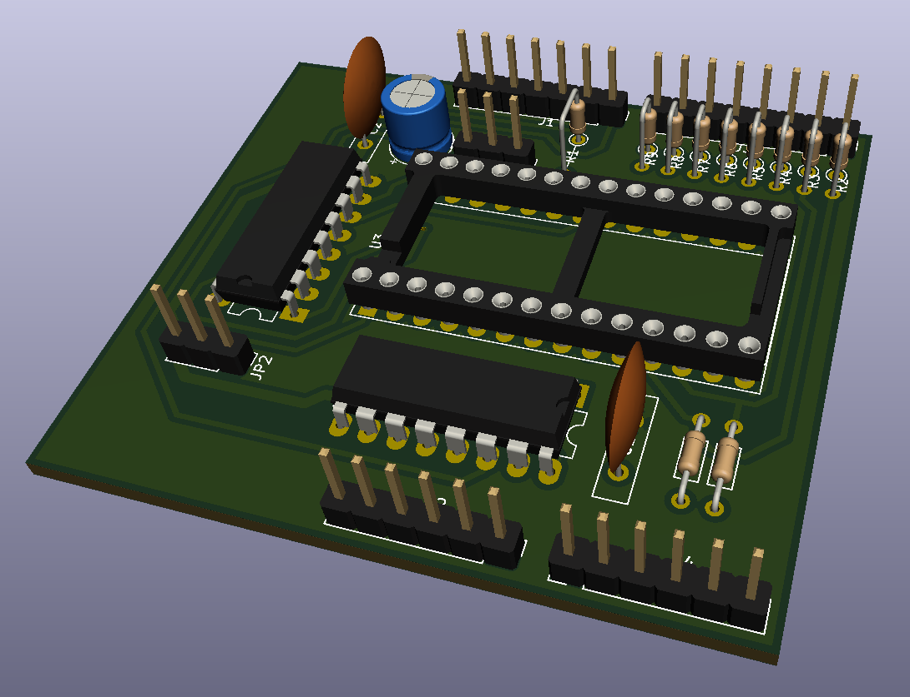

# Arduino-Shield to flash EEPROMs

This is an Arduino shield that can be used to read or flash EEPROMs.
I've successfully flashed 28C16 and 28C64.

## Hardware
The schematic you can find [here](kicad/EPROM-Shield.pdf).
It has been created with KiCad 5.1.12.

The 74'595 shift registers are used to set the address lines A0-A12, /CS, /OE and /WE.
The address lines A13 and A14 for 28C128 or 28C256 are only available through jumpers, so only up to 8kB could be flashed in one row.

The EEPROMs data pins are connected via resistors to the arduino pins D0-D7 to prevent problems if the EEPROM and the Arduino accessing these pins as output.
For those arduino boards that use pins D0 and D1 for serial communication, you can use AD0 and AD1 instead.
In that case omit the resistors to D0 and D1, install those to AD0 and AD1, and change the constants `PIN_D0` and `PIN_D1` at the beginning of the [Eprommer595.ino](arduino/Eprommer595/Eprommer595.ino).

Note, you need to solder the pin headers onto the bottom side (in contrast to the below 3D view).

## Software
For simplicity the data to flash should be provided as array content (see [data_jute6k_video.h](arduino/Eprommer595/data_jute6k_video.h)).
Any output is provided over serial communication (9600 baud).

## Todo
- reserve more space around EEPROM to be able to mount a ZIF socket
